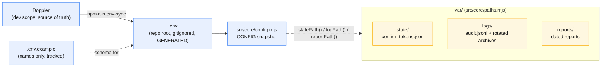

# Onramp

An opinionated, safety-first Model Context Protocol server over stdio, in Node.js.


Most MCP scaffolds are a transport and a tool list. This one ships the layer
that decides whether a call should happen at all: a registry where the schema is
the wiring, enforced input validation, an ordered effect gate, a dry-run
default, an append-only audit log with a no-audit-no-action precondition, and a
two-phase confirmation handshake for irreversible actions.

**Several of those are the corrected second implementation of a pattern that a
production system got subtly wrong.** Each one is the version a reasonable
engineer writes first, which is exactly why the correction is worth publishing.
Every module header names the mistake it corrects.

144 tests under `node --test`. Two runtime dependencies: the MCP SDK and dotenv.

## Quickstart

```bash
npm install
npm test          # node --test, 144 tests
npm start         # stdio server; normally launched BY an MCP client
```

Point an MCP client at `node server.mjs` and it lists `echo`, `health_check`,
`example_prepare_delete` and `example_delete`. To make it yours: replace the
`<SERVER_NAME>` and `<PURPOSE>` placeholders, add tools under
`src/integrations/`, wire each file into `registry.mjs` with one import, declare
an `effect` on every record, and delete the example. `CLAUDE.md` carries the
conventions, and `src/integrations/README.md` covers the tool contract.

The stdio entry point runs **natively** on the host, because MCP-over-stdio
needs a direct parent and child process relationship that a container boundary
breaks. The compose file is for a standalone worker added later.

## Request path

Every tool call takes the same route, whether it is a plain read or an
irreversible commit. `server.mjs` only wires the transport to one function;
everything that decides whether the call is allowed to happen lives in
`src/core/dispatch.mjs`.

```mermaid
flowchart LR
    Client["MCP client<br/>(Claude Desktop, LM Studio, ...)"]
    Transport["StdioServerTransport<br/>server.mjs"]
    Dispatch["dispatch()<br/>src/core/dispatch.mjs"]
    Registry["getTool()<br/>src/core/registry.mjs"]
    Validate["validateArgs()<br/>src/core/validate.mjs"]
    Gate["gate()<br/>src/core/effect.mjs"]
    Intent["auditIntent()<br/>src/core/audit.mjs"]
    Handler["tool.handler(args, ctx)<br/>src/integrations/*"]
    Outcome["auditOutcome()<br/>src/core/audit.mjs"]

    Client -->|"CallToolRequest"| Transport
    Transport --> Dispatch
    Dispatch --> Registry
    Registry --> Validate
    Validate --> Gate
    Gate -->|"read: ungated"| Handler
    Gate -->|"write / irreversible"| Intent
    Intent --> Handler
    Handler --> Outcome
    Handler --> Transport
    Outcome --> Transport
    Transport -->|"CallToolResult"| Client

    class Client,Transport io
    class Dispatch,Registry,Validate,Gate core
    class Intent,Outcome audit
    class Handler handler

    classDef io fill:#e8f0fe,stroke:#4285f4,color:#1a1a1a;
    classDef core fill:#fef7e0,stroke:#f9ab00,color:#1a1a1a;
    classDef audit fill:#fce8e6,stroke:#ea4335,color:#1a1a1a;
    classDef handler fill:#e6f4ea,stroke:#34a853,color:#1a1a1a;
```



A `read` tool skips the audit step entirely and goes straight from the gate to
its handler. A `write` or `irreversible` tool gets an audit **intent** record
before the handler runs and an **outcome** record after, so a process that
dies mid-call leaves evidence rather than silence. See
[The pipeline](#the-pipeline) and [The gate](#the-gate) below for what each
step actually checks.

## What this corrects

### `confirm: true` is not a confirmation

The obvious way to gate a destructive tool is a boolean argument. It is broken,
and the reason is one sentence: **the flag is supplied by the model, and the
model is the thing being gated.** A model that ingested untrusted content
earlier in the session sets `confirm: true` as readily as it sets any other
argument. It is a parameter with a reassuring name.

So the server mints the approval instead. 256 bits of entropy so it cannot be
forged, single use so it cannot be replayed, TTL bounded so it is not a standing
permission, and bound to both the resource id and a hash of the payload so an
approval obtained for a harmless call cannot be spent on a different one.

The hash covers the **raw** payload, never the redacted preview. Hash the
redacted form and two materially different payloads whose secrets both redact to
`[REDACTED]` collide, and approval for one authorizes the other.

Validation and consumption are separate functions. A dry run validates without
spending, because if previewing burns the token then people learn to skip
previewing, which defeats the mechanism entirely.

### Logging the audit record after the write loses it

Write the record after the effect and a crash between the two loses it
permanently. On an idempotency-marked path it is never retried and never
backfilled: the effect is real, and there is no evidence it happened.

The pull toward this mistake is strong, because you naturally want to log the
*result*, and the result only exists afterward.

So there are two records. An **intent** before, an **outcome** after, correlated
by id. An intent with no outcome is not a bug in the log, it is the incident
signal: something was about to happen and nobody knows whether it finished.

The log stores a SHA-256 of the redacted payload and never the payload. That
still proves "this action happened to this resource with exactly these bytes"
for dispute resolution, without turning the audit log into a second copy of
everything you were careful to redact everywhere else.

### A writability probe that only opens the file lies on Windows

`fs.openSync(<directory>, "a")` **succeeds** on Windows. Only the first written
byte fails, with `EISDIR`.

An open-only check therefore reports a healthy audit log right up until the
first record is silently dropped, which is the one moment the check existed to
prevent. The probe writes real bytes to a scratch file and unlinks them.

Accountability that is best-effort is not accountability: if the log can fail
quietly, its absence proves nothing, and it is worthless in precisely the
incident you built it for. So an unwritable log is a **refusal to act**, which
turns a silent logging failure into a loud, safe outage.

### An approval token at rest is a bearer credential

Records store `tokenSha256`, never the token. Anyone who could read
`var/state/confirm-tokens.json` could otherwise lift a pending approval and
spend it. A reader of the file learns that an approval exists and what it is
bound to, and cannot present it.

Same reasoning as never storing a password. An approval to perform an
irreversible action deserves the same treatment.

### A taxonomy that made the safe path unusable

The first version of the effect classes put the token-minting half of a
two-phase pair in the `write` class, which sat behind the dry-run gate. A fresh
clone could therefore never mint an approval, so the two-phase flow could not be
exercised at all until the operator disabled the very safety that made it
interesting.

The axis is **outward** effect, and only outward effect. A tool that keeps its
own state in `var/` is still a read. A safety design that makes the safe path
unusable is one that gets switched off, and then nothing is gated.

### An escalation that could not escalate

`MCP_CONFIRM_REQUIRED_EXTRA` lets an operator force a named tool through
confirmation without editing someone else's tool file. It exists precisely
because you may not trust a third-party integration's own claim about how
dangerous it is.

The gate consulted that list *after* reads had already been waved through, so
escalating a tool that declared itself a read did nothing at all, silently. The
one case the knob was built for was the one case it could not serve. Escalation
now resolves before the short circuit, and an escalated tool picks up the dry
run and the audit record too.

## The pipeline

Every call goes through one function, because a convention each tool author has
to remember is a convention one of them forgets:

```
lookup -> validate -> gate -> audit intent -> run -> audit outcome
```

Validation runs **before** the gate. Untrusted arguments must not feed an
authorization decision, and a caller that sent a malformed request deserves the
schema error rather than a confusing denial about a missing approval.

That validation closes a real gap. The low-level SDK `Server` class validates
the JSON-RPC envelope and nothing else, so a declared `required` field is
documentation addressed to the model rather than a constraint the server
enforces. `validate.mjs` enforces it with no new dependency.

## The gate

Three effect classes, and one ordered decision per call:

| Class | Meaning |
|---|---|
| `read` | Reaches nothing outside the process; may keep local state. |
| `write` | Reaches outside, but can be undone or repeated without harm. |
| `irreversible` | Cannot be taken back. The only class that requires a token. |

| Step | Checks |
|---|---|
| `class` | The tool declared a known effect class. |
| `mode` | Dry run or live; never a denial, it selects the path. |
| `accountability` | The audit log is provably writable (live non-reads only). |
| `approval` | A valid, unconsumed, correctly bound token (irreversible only). |

A denial reports `deniedAt` naming the step that produced it, so a caller
learning the log is unwritable is distinguishable from one learning it needs a
token. One boolean would tell it neither, and a test asserts each step by name,
so reordering the pipeline breaks a named test rather than quietly changing what
the server permits.

**`MCP_DRY_RUN` defaults to `true`.** A fresh clone, run before anyone reads the
docs, must not be able to send a message or destroy a record.

Reads stop at step one, ungated and said out loud. An undocumented ungated
path is a problem; a documented one is a decision.

## Two-phase in practice

`src/integrations/example/confirm-example.mjs` is the copyable pattern:

```bash
# Phase 1: read the target, preview it, mint a token bound to a hash of the
# exact commit payload. effect "read", so it runs in the dry-run default.
example_prepare_delete  { "resource_id": "rec-1" }

# Phase 2: spend it. effect "irreversible", so the gate validates and consumes
# the token before the handler is entered.
example_delete          { "resource_id": "rec-1", "confirm_token": "..." }
```

**A commit handler must never re-check the token.** By the time it runs the
dispatcher has validated it, confirmed the log is writable, spent it and written
the intent. A second check is a second chance to get it wrong.

## Architecture

```
server.mjs                 stdio transport, MCP handlers, one dispatch call
src/core/dispatch.mjs      the pipeline every tool call goes through
src/core/registry.mjs      tool records; the schema IS the wiring
src/core/effect.mjs        effect classes and the ordered gate
src/core/confirm.mjs       server-minted, single-use approval tokens
src/core/audit.mjs         append-only JSONL log, intent plus outcome
src/core/validate.mjs      inputSchema enforcement, no new dependency
src/core/config.mjs        the ONE reader of process.env, frozen at import
src/core/paths.mjs         var/ layout, plus respond/util/emoji helpers
src/integrations/example/  echo plus the two-phase worked example
scripts/                   env-sync and the test bootstrap
test/                      node --test suites
```

Every module imports the frozen `CONFIG` snapshot rather than reading
`process.env` again, so no gate invents its own coercion and gets it backwards.

## Runtime layout and env sync

Runtime output and config are deliberately kept apart. `.env` is config, not
runtime output, and stays at the repo root, gitignored and generated by
`npm run env-sync`. Everything the server writes while running (state, logs,
dated reports) lives under `var/`, which is **the only volume a container
needs**.



The confirm store is `var/state/confirm-tokens.json`; the audit log is
`var/logs/audit.jsonl` with size-rotated archives. Subdirectories are created
lazily, and a same-named legacy file at the repo root migrates into `var/` on
first resolution.

On Windows, the confirm store's atomic rename retries briefly on a transient
`EPERM`, which the search indexer and antivirus cause at roughly one full test
run in fifty. Failing closed there was correct but invisible, and a confirmation
that refuses at random for a reason the operator cannot see is how a safety
feature gets switched off.

## Configuration

`.env` is never hand-written or committed. Declare a new name in
`.env.example`, give it a value in Doppler, then run `npm run env-sync`.

| Variable | Meaning | Default |
|---|---|---|
| `MCP_SERVER_NAME` | Name shown in the MCP registration and prefixed on stderr logs. | `<SERVER_NAME>` |
| `MCP_TOOLSET` | Category filter for which tools this process exposes. | `all` |
| `MCP_DRY_RUN` | Whether the process may cause outward effects. | `true` |
| `MCP_CONFIRM_TTL_MS` | How long a confirm token stays spendable. | 15 minutes, clamped to 1 hour |
| `MCP_AUDIT_MAX_BYTES` | Size at which `var/logs/audit.jsonl` rotates. | in-code default |
| `MCP_AUDIT_KEEP_FILES` | How many rotated audit archives are retained. | in-code default |
| `MCP_AUDIT_REDACT_EXTRA` | Comma-separated argument names to scrub before hashing, widening an in-code default set. | (none) |
| `MCP_CONFIRM_REQUIRED_EXTRA` | Comma-separated tool names to force through two-phase confirmation, widening an in-code default set. | (none) |
| `MCP_ENV_FILE` | Alternate path for the dotenv loader; mainly a test hook. | `.env` next to `server.mjs` |

The two `*_EXTRA` variables are widen-only allowlists: each one extends an
in-code default set and has no form that narrows or replaces it, so a
malformed or empty value can never silently open a gate.

## Limitations

Read these before trusting the layer above with anything that matters.

- The token gates **what** is sent, not **who** decided to send it. The model
  still chooses when to spend a token it holds, and one minted during a poisoned
  turn can be spent in that same turn. What it buys is that the bytes someone
  approved are the bytes that ship. **This is not human-in-the-loop approval**,
  which would need an out-of-band channel a stdio server cannot reach.
- Roles are structural, not identity-based. `MCP_TOOLSET` selects which surface
  a call arrived on and that is the whole of the scoping. No login, no session,
  no user, and nothing here can answer "who asked".
- `validate.mjs` covers a documented subset of JSON Schema: `type` (including a
  union array), `required`, `enum`, `minimum`, `maximum`, `minLength`,
  `maxLength`, `items`, `properties`, `additionalProperties`. `$ref`, the
  `allOf`/`anyOf`/`oneOf` combinators, `pattern`, `format`, `const`,
  `minItems`/`maxItems`, `uniqueItems`, `multipleOf`, the exclusive bounds,
  tuple `items` and `default` are ignored. A constraint outside that list
  belongs in the handler.
- Reads are ungated by design: no dry run, no audit record, no approval.

## License

MIT. See `LICENSE`.
